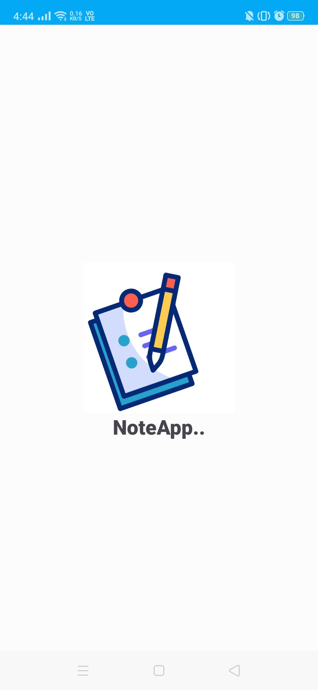
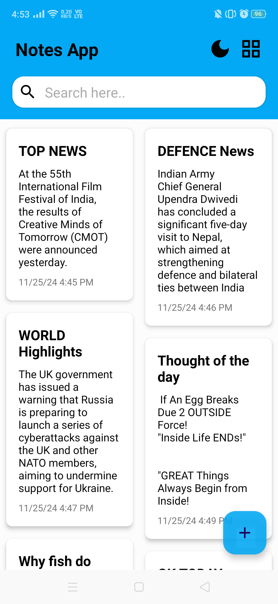
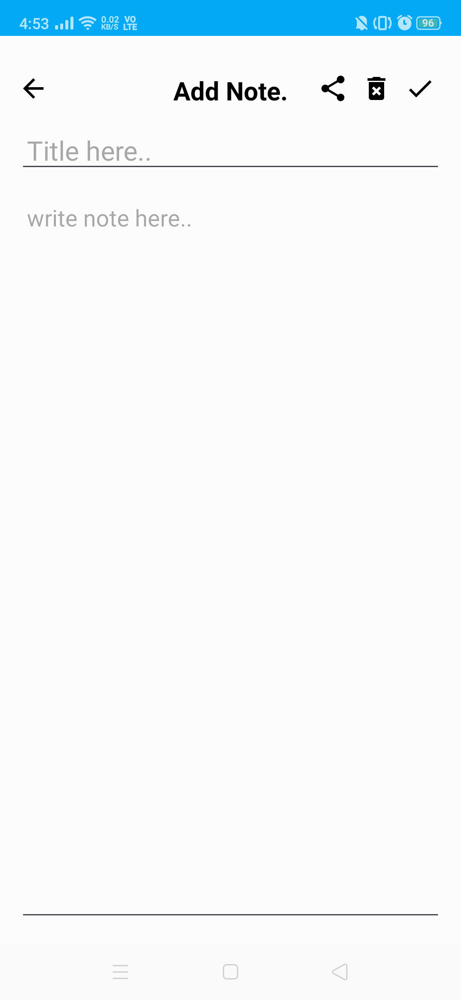
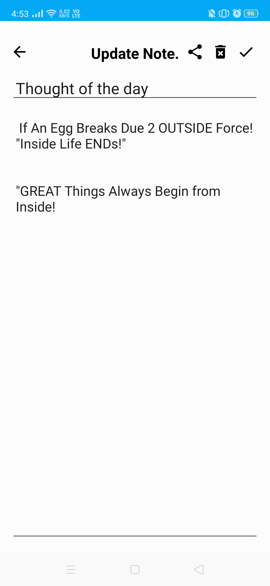
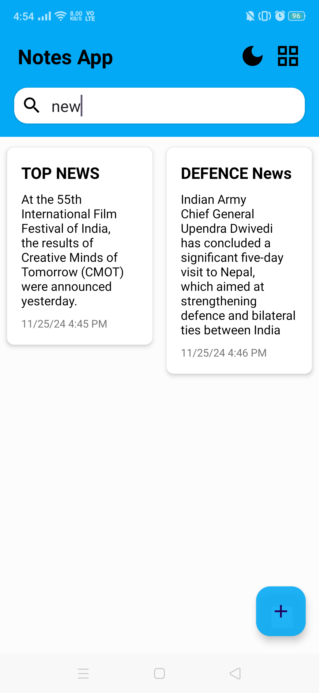
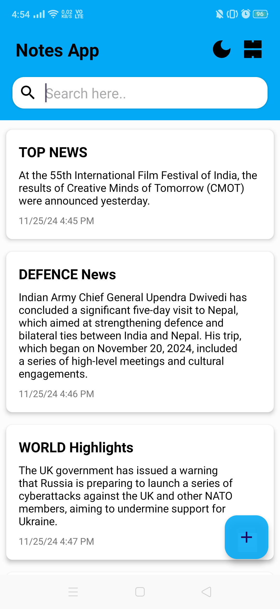

# Note App - Android (Java)

This is a simple yet powerful **Note App** built for Android using **Java**. The app allows users to create, read, update, and delete (CRUD) their notes. It features a dynamic and user-friendly interface that adapts to the user's actions, providing a smooth experience for managing notes on Android devices.

# ***Screenshots*** 
 ***s***

 

**Feature**:
The Notes Android App offers the following features:

-   **Create new notes:**  Users can easily create new notes by providing a title and content for each note.
-   **Edit notes:**  Existing notes can be edited to update the title or content.
-   **Delete notes:**  Users have the option to delete unwanted notes.
-   **Categorize notes:**  Notes can be organized into categories such as Linear or Grid  to help users better manage their notes.
-   **Search functionality:**  Users can search for specific notes based on keywords or titles.
-   **Share functionality:**  Users can share the specific notes to various app such whatsapp, sms, etc.
-   **User-friendly interface:**  The app provides a simple and intuitive interface for seamless note-taking and management.

## Usage 

Once the Notes Android App is installed and running on an Android device, users can perform the following actions:

-   Create a new note by tapping the "+" button available in Bottom right corner  and providing a title and content for the note.
-   Edit an existing note by clicking on specific note from the list  of note and making the desired changes.
-   Delete a note by holding the note it will show one pop-up menu with delete option by pressing the delete option the note has been deleted.
or  you can perform the deletion from opening the specific note and delete icon will show on right top corner, by clicking on delete icon it will show one dialog for confirm delete. Once the confimation has been done the note is deleted.
-   Organize notes into specific order such as Liner or grid.
- Share  note by holding the note it will show one pop-up menu with share option by pressing the share option you can share note where ever you want.
or you can perform the share functionality from opening the specific note and share icon will show on right top corner, by clicking on share icon you can share you the note.

## Technologies Used

-   **Language**: Java, XML
-   **SQLite**: A local database used to store notes.
-   **RecyclerView**: A dynamic view for displaying lists of data in the UI.
-   **Intents and Activities**: Used for navigation between different screens (Create/Edit/View notes).

## Prerequisites

To build and run this project, you need:

-   **Android Studio** .
-   An **Android device** or **emulator** to run the app.

### Key Components

#### 1. **NoteDate.java**

-   A Java class that represents a note with attributes title ,content and date.
-   Includes constructor and  getter and setter methods for these fields.

#### 2. **DatabaseHelper.java**

-   A helper class for interacting with the SQLite database.
-   Handles the creation, retrieval, updating, and deletion of notes.
-   Provides methods like addNote(), fetchData(), updateNote(), and deleteNote().

#### 3. **MainActivity.java**

-   The main screen that lists all the notes.
-   Implements a `RecyclerView` to display the notes dynamically.
-   Provides buttons to add new note.
- Having  method such as filter() for filter(search) note, implemented delete() and etc.

#### 4. **AddUpdateActivity.java**

-   Activity for creating a new note and updating the existing note.
-   It has also OnClickListener for sharing note and deleting note.

#### 5. **NoteAdapter.java**

- It will Managing and displaying data within UI components like , RecyclerView, ListView etc. They handle the data-binding process, efficiently recycling views, and managing different types of data sources.
  
#### 6. **ItemClick interface**
- this interface is used to handle the delete operation which is implemeted by the MainActivity.java.

#### 7. **SplaceScreen.java**
It is a constant screen that appears for a specific amount of time and generally shows for the first time when the app is launched. this screen is used to display some basic introductory information such as the note logo, content, etc just before the app loads completely.

